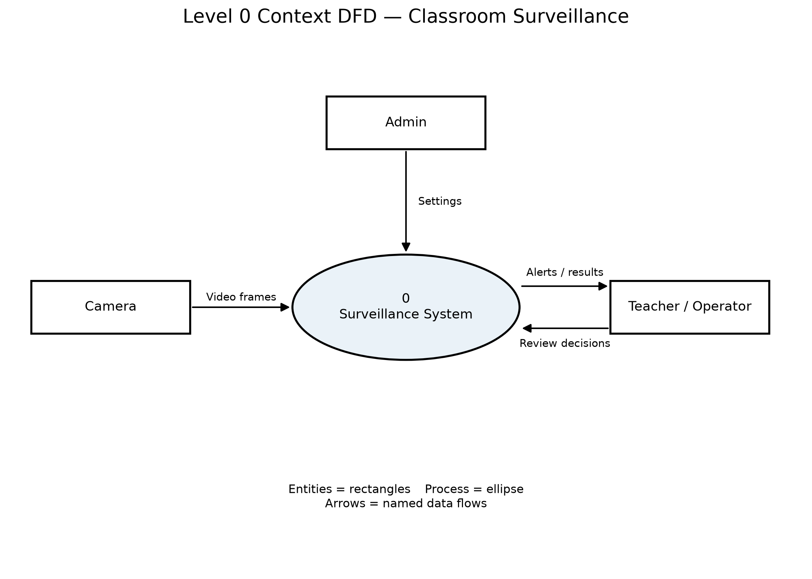
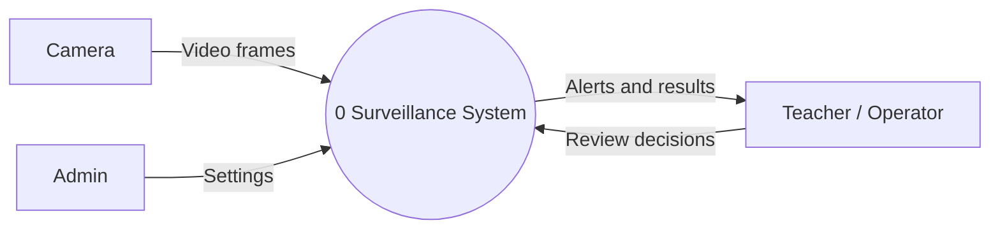
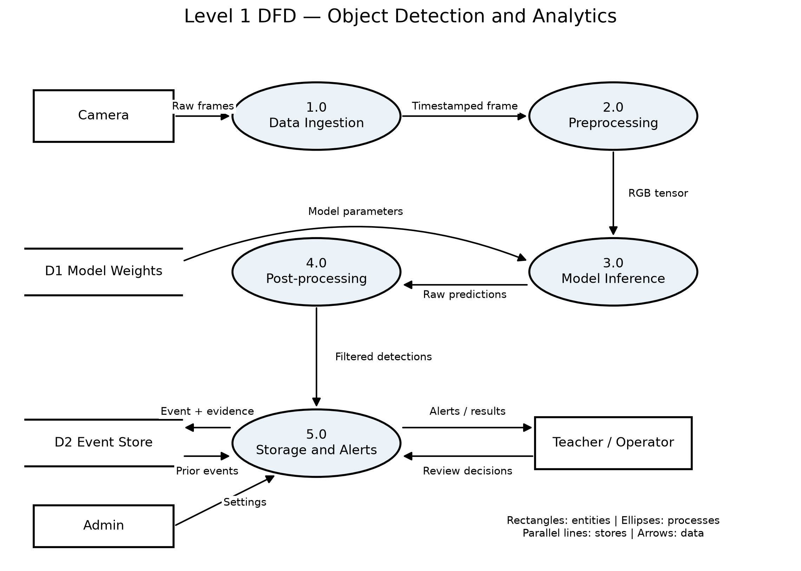
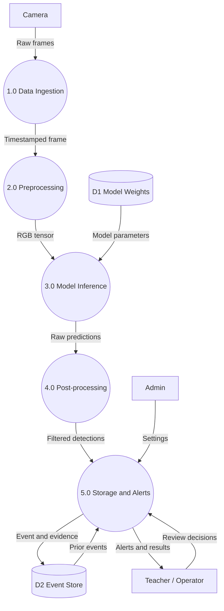

# System Design Specification

**Course:** AI Project Design and Development — Lab 02  
**Student:** Hassan Bin Saqib — 231170

This document covers the five Lab 2 tasks. Task 1 follows the manual's smart attendance scenario. Tasks 2–4 use the classroom surveillance project from Lab 1. This is a simple design specification; recognition accuracy and real-time behavior have not been measured.

## Task 01 Smart Automated Attendance Requirements

The system marks attendance when a registered student is recognized at the classroom entrance. The teacher reviews uncertain matches. These are proposed requirements, not measured results.

### Functional requirements

| ID | Requirement | Simple acceptance check |
| --- | --- | --- |
| FR1 | An admin can enroll a student using their ID, name and consented face images. | The enrolled student appears in the class roster. |
| FR2 | The system detects faces in the camera feed and compares them with enrolled students. | A known student is matched; an unknown face is marked unknown. |
| FR3 | It records student ID, class, date and time for a recognized student. | A timestamped attendance record is saved. |
| FR4 | It avoids duplicate attendance for the same student in the same class session. | Two detections produce one attendance record. |
| FR5 | The teacher can review, correct and export attendance; offline records sync when the connection returns. | An edited record appears in the export and pending records sync without duplicates. |

### Non-functional requirements

| ID | Requirement | Proposed target |
| --- | --- | --- |
| NFR1 | Attendance should appear promptly after a usable face is captured. | Within 2 seconds on the chosen device. |
| NFR2 | Camera processing should remain responsive. | At least 5 processed frames per second at 640 x 640. |
| NFR3 | Recognition should be reliable on a held-out, consented test set. | At least 95% correct identity decisions and below 1% false acceptance. |
| NFR4 | Student records and face data must have restricted access. | Only authorized admins and teachers can access records; encrypt stored face data. |
| NFR5 | The system should fit a modest classroom computer. | At most 2 GB application RAM and 15 W average power on a selected edge device. |

Accuracy, frame rate and power targets need testing. Low-confidence matches go to teacher review instead of automatic attendance.


## Task 02 Surveillance Boundary and Input Output Mapping

Scenario: a classroom camera flags visible phones and repeated suspicious movement for teacher review. This is the project from Lab 1. It is separate from the smart attendance exercise in Task 1.

### Actors and users

| Actor | Persona and responsibility |
| --- | --- |
| Teacher / operator | Supervises an exam, sees alerts and confirms or dismisses them. |
| Admin | Configures the camera, allowed objects, alert thresholds and access. |
| Camera / automated trigger | Supplies frames; detection and timing rules trigger candidate events. |

### System boundary

| Inside the system | Outside the system |
| --- | --- |
| Frame capture, preprocessing, object inference, filtering, event logging and alert display. | Camera hardware, classroom network and storage hardware. |
| Configuration loading and teacher review records. | Final disciplinary decisions, student identity verification and university policy. |

### Inputs

| Input | Format and meaning |
| --- | --- |
| Classroom video | USB camera index 0 or an RTSP URL; 1280 x 720 BGR frames at up to 15 FPS. |
| Camera metadata | Camera ID and capture timestamp attached to each frame. |
| Settings | JSON confidence threshold 0.65, target classes person and cell phone, and a 4-second proposed behavior threshold. |
| Operator decision | Confirm or dismiss an event by event ID. |

### Outputs

| Output | Format and meaning |
| --- | --- |
| Detection | Class name, confidence and bounding box (x1, y1, x2, y2) in original-image pixels. |
| Display | Annotated frame and candidate alert for the operator. |
| Event log | CSV with timestamp, camera ID, class, confidence and bounding box. |
| Evidence | A short event snapshot or clip linked to an event ID. |
| Review record | Event ID, reviewer decision and timestamp. |

### Operational constraints

| Constraint | Initial assumption |
| --- | --- |
| Compute | One camera on a laptop CPU; process sampled frames at 640 x 640. Do not promise real-time speed before measurement. |
| Memory | Aim for at most 2 GB application RAM; keep a small frame buffer. |
| Network | One compressed stream with a 4 Mbps budget; local USB capture needs no network bandwidth. |
| Visibility | Good lighting and visible faces/objects; occlusion can reduce detection quality. |
| Storage and privacy | Local restricted event storage; proposed deletion after 7 days. School policy must confirm retention. |

Object detections alone do not identify cheating. Head movement needs a later pose/tracking component; the Lab 2 interfaces describe the object-detection pipeline only.


## Task 03 Data Flow Diagrams

The context diagram shows the whole system as one process. The Level 1 diagram expands it into ingestion, preprocessing, inference, post-processing and storage/alerts. Camera, admin and teacher are external entities. Model weights and saved events are data stores.

The exported PNGs use rectangles for entities, ellipses for processes, parallel lines for stores and named arrows for data flows. Mermaid sources use database cylinders for stores.

### Level 0 Context





### Level 1





Preprocessing keeps the scale and padding so post-processing can return bounding boxes in original-image pixels. Storage and Alerts uses admin settings, checks recent events, saves evidence, presents results and records the teacher's review decision.

## Task 04 Modular Python Architecture

| Module | Responsibility | Main input | Expected return |
| --- | --- | --- | --- |
| DataIngestion | Open source, capture timestamped frames and release resources. | Camera index or RTSP URL. | FramePacket or None at end/failure. |
| ImagePreprocessor | Letterbox, convert BGR to RGB and normalize. | uint8 H x W x 3 frame and size. | PreprocessedFrame with tensor, shape, scale and padding. |
| ModelInferenceEngine | Load weights and run inference on CPU. | Weights path; PreprocessedFrame. | Raw model-specific predictions. |
| DetectionPostprocessor | Apply confidence filter/NMS and restore coordinates. | Raw predictions, preprocessing metadata and threshold. | list[Detection]. |
| AlertLogger | Apply event policy, store event and notify operator. | FramePacket and filtered detections. | Event ID or None; notification success bool. |

The signatures below are the skeleton design. They are abstract interfaces, not a completed detection implementation. An implementation may wrap Ultralytics output behind these interfaces without preprocessing the image twice.

```python
"""Lab 02 Task 04: interfaces only; no inference or camera access runs here."""
from abc import ABC, abstractmethod
from dataclasses import dataclass
from datetime import datetime
from typing import Any
import numpy as np
from numpy.typing import NDArray

Frame = NDArray[np.uint8]
Tensor = NDArray[np.float32]


@dataclass(frozen=True)
class FramePacket:
    image: Frame
    camera_id: str
    timestamp: datetime


@dataclass(frozen=True)
class PreprocessedFrame:
    tensor: Tensor
    original_shape: tuple[int, int]
    scale: float
    padding: tuple[int, int]


@dataclass(frozen=True)
class Detection:
    class_name: str
    confidence: float
    bbox: tuple[float, float, float, float]


class DataIngestion(ABC):
    """Open a camera/RTSP source, read timestamped frames and release it."""
    @abstractmethod
    def open(self, source: int | str) -> None: ...

    @abstractmethod
    def read_frame(self) -> FramePacket | None: ...

    @abstractmethod
    def close(self) -> None: ...


class ImagePreprocessor(ABC):
    """Letterbox, convert BGR to RGB and normalize to float32 [0, 1]."""
    @abstractmethod
    def preprocess(self, frame: Frame, size: tuple[int, int] = (640, 640)) -> PreprocessedFrame: ...


class ModelInferenceEngine(ABC):
    """Load model weights and infer on CPU; return raw predictions."""
    @abstractmethod
    def load_model(self, weights_path: str, device: str = "cpu") -> None: ...

    @abstractmethod
    def predict(self, prepared: PreprocessedFrame) -> Any: ...


class DetectionPostprocessor(ABC):
    """Filter predictions, apply NMS if needed and map boxes to original pixels."""
    @abstractmethod
    def filter_detections(self, predictions: Any, prepared: PreprocessedFrame,
                          confidence: float = 0.65) -> list[Detection]: ...


class AlertLogger(ABC):
    """Persist qualified events and notify the teacher; apply duplicate cooldown."""
    @abstractmethod
    def log_event(self, packet: FramePacket, detections: list[Detection]) -> str | None: ...

    @abstractmethod
    def notify(self, event_id: str, message: str) -> bool: ...
```

## Task 05 Unified Specification and Repository Evidence

This `ARCHITECTURE.md` brings together the requirement tables, boundary and input/output sheet, both DFDs, and class interfaces.

| Deliverable | File |
| --- | --- |
| Task 1 requirement tables | `lab-02/requirements.md` |
| Task 2 specification sheet | `lab-02/boundary_specification.md` |
| Task 3 high-resolution DFDs and editable source | `lab-02/diagrams/dfd_level_0.png`, `dfd_level_1.png`, and `.mmd` files |
| Task 4 Python interfaces | `lab-02/interfaces.py` |
| Task 5 unified specification | `ARCHITECTURE.md` |
| Task-wise Word submission | `lab-02/Lab02_Deliverables.docx` |

### Basic validation

Compile the interfaces and inspect the diagrams:

```powershell
.\aipdd_env\Scripts\python.exe -m py_compile lab-02/interfaces.py
.\aipdd_env\Scripts\python.exe lab-02/generate_dfds.py
```

The generator recreates both PNG diagrams. No webcam, model download or inference is needed for Lab 2.
